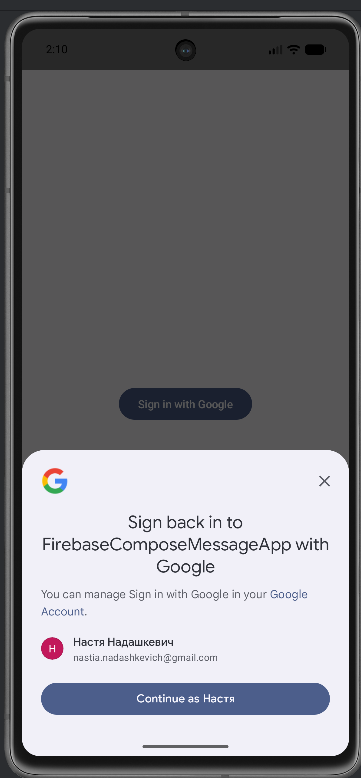
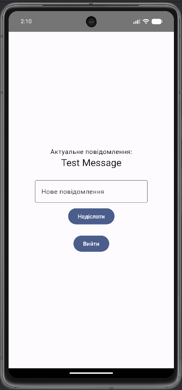

📱 Firebase Compose Message App

Android-застосунок, створений на Kotlin з використанням Jetpack Compose та Firebase.
Додаток дозволяє користувачам:

✅ Увійти за допомогою Google
✅ Відправляти повідомлення в Cloud Firestore
✅ Отримувати актуальне повідомлення в реальному часі
✅ Вийти з акаунта

🚀 Функціонал

| Функція                | Опис                                                              |
| ---------------------- | ----------------------------------------------------------------- |
| Google Sign-In         | Авторизація за допомогою Google через Firebase Authentication     |
| Відправка повідомлення | Дані зберігаються у Firestore (`messages/latest`)                 |
| Live-update            | Нове повідомлення автоматично відображається без перезавантаження |
| Sign Out               | Вихід із акаунта, повернення на екран входу                       |

🛠️ Технології

* **Kotlin**
* **Jetpack Compose**
* **Firebase Authentication (Google Sign-In)**
* **Firebase Firestore**
* **MVVM + ViewModel**
* **Android Studio**

⚙️ Вимоги

* Android Studio Hedgehog / Jellyfish
* Android SDK 26+
* Firebase проєкт із:

    * Authentication → Google enabled
    * Firestore enabled
    * Додані SHA-1 і SHA-256 ключі
* Скачаний `google-services.json` у `/app` директорії

▶️ Запуск

1. Клонувати репозиторій
2. В Android Studio відкрити проєкт
3. Додати `google-services.json` у `/app`
4. Запустити на пристрої або емуляторі

🧾 Скриншоти

| Sign In      | Chat Screen |
| ------------ | --------- |
|  |  |

👤 Автор

Nastia Nadashkevich

